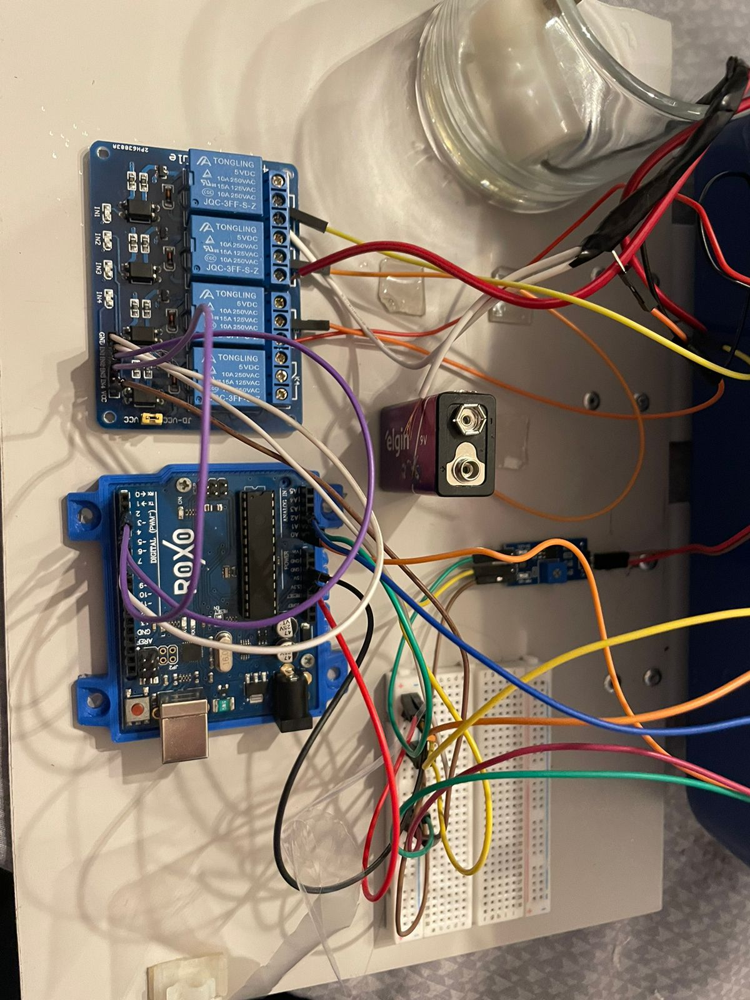
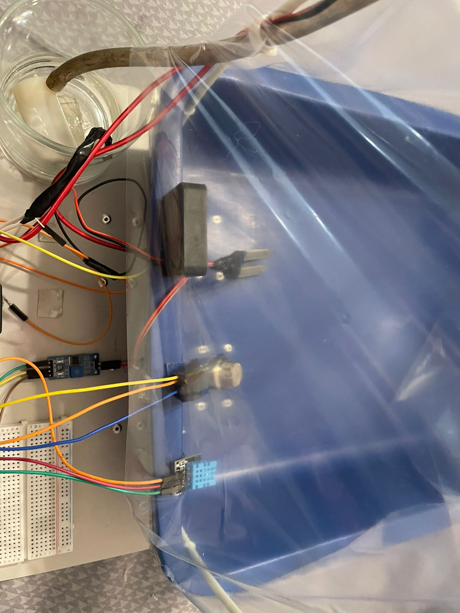
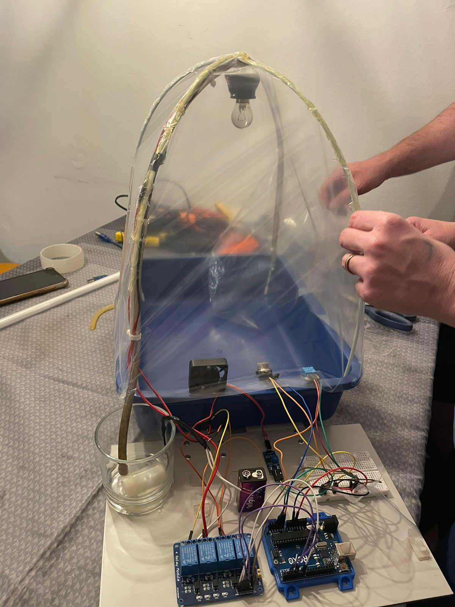

# ESTUFA AUTOMATIZADA CONTROLADA PELA INTERNET COM ARDUINO

OBS: para testar devidamente o projeto é necessário o arduino com a montagem especifica* 
Caso não tenha é possível "simular" utilizando a página de simulação, a mesma roda por si só.

``TUTORIAL DE USO:``

1. PASSO:
   -montagem do arduino da seguinte forma:
   
   
   
 
levantamento de materiais:  
   -arduino uno 
   -relé de 4 interruptores 
   -breadboard 
   (ligada na bread board) 
      -lampada (porta digital 4)  
      -ventoinha (porta digital 2) 
      -bomba d'água (porta digital 7) 
   (+ 3 bateriais 9V para alimentar esses componentes) 
   -sensor dht11 de temperatura (porta analogica A0) 
   -sensor de gases (porta analogica A2) 
   -sensor umidade (porta analogica A1) 
   

3. PASSO:
   -Carregar o código da pasta arduino desse mesmo repositório através do USB na placa.
   (sendo antes necessário adicionar a biblioteca DHT11 adafruit a sua IDE, driver necessário para fazer uso do sensor de temperatura DHT11)
    
    
4.PASSO:
  Pela falta de um ESP-01 como servidor wifi, optamos por fazer a comunicacão serial da placa com um computador, fazendo o mesmo rodar uma API flask
  para permitir o acesso aos recursos da placa através de meios externos como websites e aplicativos.
   -Para isso:
     *Antes de tudo é necessário ter o python e pip instalados em sua máquina
   -Baixar a pasta python nesse mesmo repositório, abri-la em seu computador e baixar as seguintes dependências: 
   `pip install pyserial` 
   `pip install flask` 
   com o código funcionando corretamente, basta ligar o arduino a seu computador e rodar o código python usando: 
   `python index.py` 
   
``a partir desse momento todo o back-end já está em funcionamento``  
5.PASSO: 
    -após baixar o front-end (com a placa) e abrir a pasta em sua IDE de escolha, basta rodar o HTML que ele automáticamente puxará os dados da API flask.
